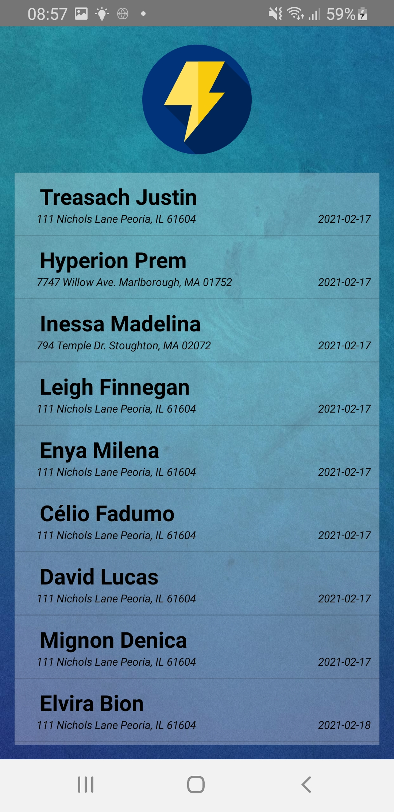
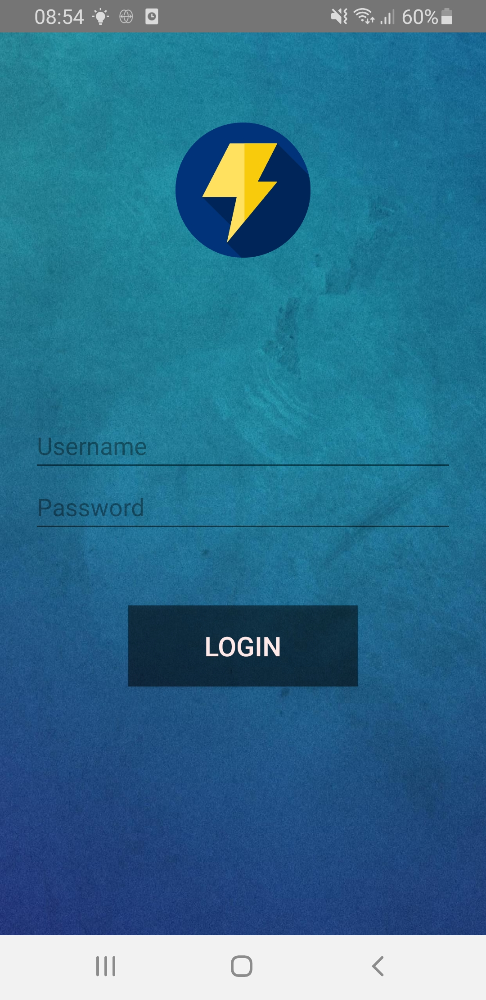
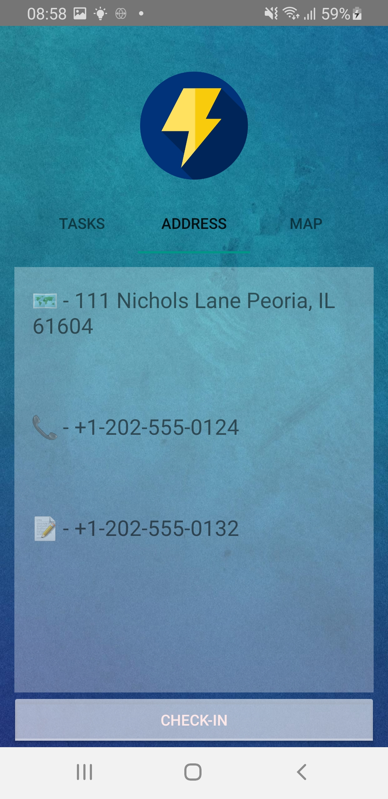
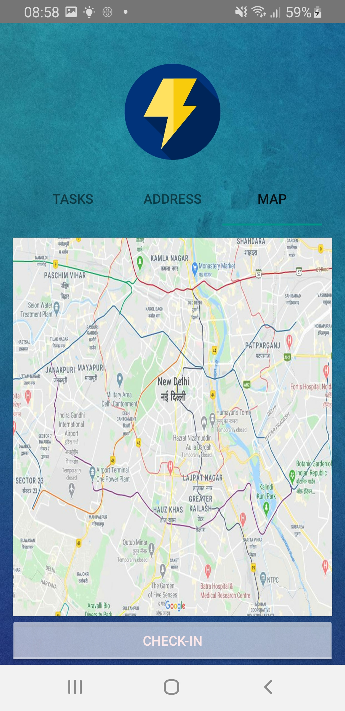
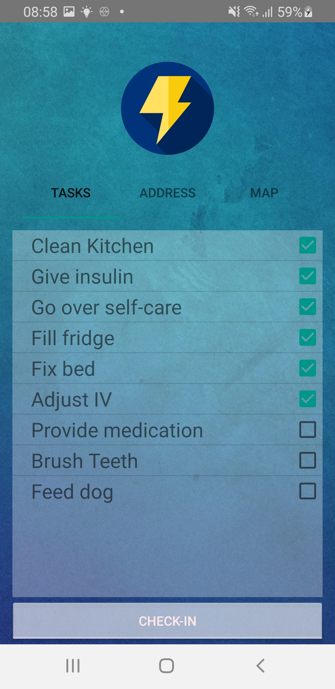

# ZAPP

ZAPP (ZorgAPP) is a case study application as a part of my education at Educom. The purpose of this application is to help healthcare workers perform their tasks and duties for their respective patients. Users can log into the application and are redirected to a list of their appointments for today and tomorrow (sorted by ascending time). Each appointment can be clicked which then relays to a detail screen that shows the specific tasks that need to be performed per appointment. Moreover, the detail page contains a map to the house of the patient, the specific address, the contact number and the number of the planner. Lastly, each clicked appointment has a check-in/check-out button which documents the time spent on each appointment (which is then used as a time sheet for each user). When an appointment is checked out, it is removed from the list of appointments.

The planner can add/update the tasks, activities, users and all data via the Restful API (Cockpit) which functions as the self-hosted 
Content management system. Furthermore, the API is synchronized with the SQLite database of ZAPP and receives all updated tasks and activities.

# Technologies used

* **C#
* **Restful API
* * **SQLite
* * **Xamarin
* **XML
* **.Net

# UX Design / Prototype

Thank you for viewing my ReadMe of ZAPP. I hope you enjoyed reading it as much as I enjoyed coding it!
